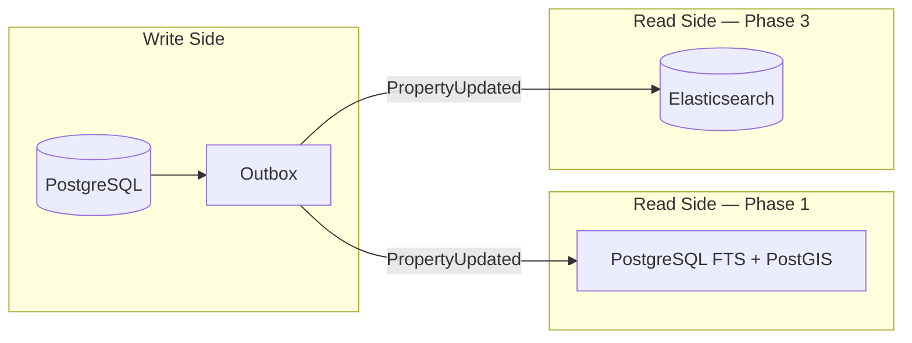
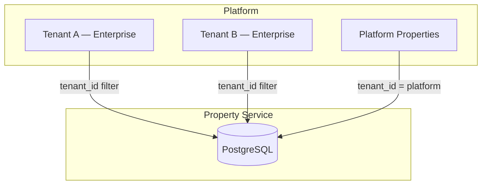

# 4. Entity Relationship Diagram

## Core ERD

```mermaid
erDiagram
    PROPERTIES ||--o| PROPERTY_ADDRESSES : has
    PROPERTIES ||--o| PROPERTY_PARCELS : has
    PROPERTIES ||--o| PROPERTY_BUILDINGS : has
    PROPERTIES ||--o| PROPERTY_FEATURES : has
    PROPERTIES ||--o| PROPERTY_METADATA : has
    PROPERTIES ||--o| PROPERTY_LISTINGS : has
    PROPERTIES ||--o{ PROPERTY_AMENITIES : has
    PROPERTIES ||--o{ PROPERTY_IMAGES : has
    PROPERTIES ||--o{ PROPERTY_VIDEOS : has
    PROPERTIES ||--o{ PROPERTY_DOCUMENTS : has
    PROPERTIES ||--o{ PROPERTY_OWNERSHIP : has
    PROPERTIES ||--o{ PROPERTY_TAGS : has
    PROPERTIES ||--o{ PROPERTY_EXTERNAL_SOURCES : has
    PROPERTIES ||--o{ PROPERTY_PRICE_HISTORY : tracks
    PROPERTIES ||--o{ PROPERTY_STATUS_HISTORY : tracks
    PROPERTIES ||--o{ PROPERTY_VERSIONS : snapshots
    PROPERTIES ||--o{ PROPERTY_AUDIT_LOGS : audits
    PROPERTIES ||--o{ OUTBOX_EVENTS : publishes

    PROPERTY_TYPES ||--o{ PROPERTIES : classifies
    AMENITY_DEFINITIONS ||--o{ PROPERTY_AMENITIES : defines

    PROPERTIES {
        uuid id PK
        uuid tenant_id
        varchar property_code UK
        varchar slug
        varchar title
        text description
        varchar property_type FK
        varchar property_category
        varchar status
        numeric sale_price
        numeric rental_price
        char currency
        char country_code
        varchar province
        varchar district
        numeric latitude
        numeric longitude
        geography location
        varchar geohash
        numeric net_area_sqm
        numeric room_count
        smallint bathroom_count
        smallint construction_year
        tsvector search_vector
        int version
        timestamptz created_at
        timestamptz updated_at
        timestamptz deleted_at
        uuid created_by
        uuid updated_by
    }

    PROPERTY_ADDRESSES {
        uuid id PK
        uuid property_id FK UK
        char country_code
        varchar province
        varchar district
        varchar neighborhood
        varchar street
        varchar postal_code
        text address_line
        numeric latitude
        numeric longitude
        geography location
        varchar geohash
        boolean is_verified
    }

    PROPERTY_PARCELS {
        uuid id PK
        uuid property_id FK UK
        varchar block
        varchar parcel_number
        numeric parcel_area_sqm
        varchar cadastral_reference
        geography boundary
    }

    PROPERTY_BUILDINGS {
        uuid id PK
        uuid property_id FK UK
        smallint construction_year
        smallint floor_count
        smallint floor_number
        varchar unit_number
        numeric net_area_sqm
        numeric gross_area_sqm
        numeric room_count
        smallint bathroom_count
        smallint parking_count
    }

    PROPERTY_FEATURES {
        uuid id PK
        uuid property_id FK UK
        varchar heating_type
        varchar cooling_type
        char energy_certificate_class
        boolean has_elevator
        boolean has_parking
        boolean has_pool
        boolean has_garden
        boolean has_smart_home
        boolean has_solar
        boolean has_ev_charger
    }

    PROPERTY_AMENITIES {
        uuid id PK
        uuid property_id FK
        varchar amenity_code FK
        varchar value
    }

    PROPERTY_IMAGES {
        uuid id PK
        uuid property_id FK
        varchar storage_key
        varchar url
        varchar thumbnail_url
        smallint sort_order
        boolean is_primary
        varchar processing_status
        timestamptz deleted_at
    }

    PROPERTY_VIDEOS {
        uuid id PK
        uuid property_id FK
        varchar video_type
        varchar url
        varchar embed_url
        varchar provider
    }

    PROPERTY_DOCUMENTS {
        uuid id PK
        uuid property_id FK
        varchar document_type
        varchar storage_key
        varchar url
        varchar file_name
        boolean verified
        timestamptz deleted_at
    }

    PROPERTY_OWNERSHIP {
        uuid id PK
        uuid property_id FK
        varchar owner_type
        varchar owner_name
        uuid owner_external_id
        numeric ownership_percentage
        date acquired_at
        date released_at
        boolean is_current
    }

    PROPERTY_TAGS {
        uuid id PK
        uuid property_id FK
        varchar tag
    }

    PROPERTY_METADATA {
        uuid id PK
        uuid property_id FK UK
        jsonb metadata
        jsonb tenant_extensions
        varchar schema_version
    }

    PROPERTY_LISTINGS {
        uuid id PK
        uuid property_id FK UK
        text original_url
        varchar provider
        varchar listing_id UK
        date listing_date
        timestamptz last_synced_at
        varchar sync_status
    }

    PROPERTY_EXTERNAL_SOURCES {
        uuid id PK
        uuid property_id FK
        varchar source_type
        text source_reference
        jsonb source_payload
        timestamptz imported_at
    }

    PROPERTY_PRICE_HISTORY {
        uuid id PK
        uuid property_id FK
        varchar price_type
        numeric old_amount
        numeric new_amount
        char currency
        timestamptz changed_at
        uuid changed_by
    }

    PROPERTY_STATUS_HISTORY {
        uuid id PK
        uuid property_id FK
        varchar old_status
        varchar new_status
        timestamptz changed_at
        uuid changed_by
    }

    PROPERTY_VERSIONS {
        uuid id PK
        uuid property_id FK
        int version_number
        jsonb snapshot
        text change_summary
        timestamptz created_at
        uuid created_by
    }

    PROPERTY_AUDIT_LOGS {
        uuid id PK
        uuid property_id FK
        uuid tenant_id
        varchar action
        uuid actor_id
        jsonb changes
        uuid correlation_id
        timestamptz created_at
    }

    OUTBOX_EVENTS {
        uuid id PK
        uuid aggregate_id FK
        varchar event_type
        jsonb payload
        varchar status
        timestamptz created_at
        timestamptz published_at
    }

    PROPERTY_TYPES {
        varchar code PK
        varchar category
        jsonb display_name
        boolean is_active
    }

    AMENITY_DEFINITIONS {
        varchar code PK
        varchar category
        jsonb display_name
        varchar value_type
        boolean is_active
    }
```

---

## Aggregate Boundary Diagram

```mermaid
graph TB
    subgraph "Property Aggregate Root"
        P[Property]
        PR[Pricing]
        LOC[Location/Address]
        PAR[Parcel]
        BLD[Building]
        FEAT[Features]
        AMN[Amenities]
        IMG[Images]
        VID[Videos]
        DOC[Documents]
        LST[Listing]
        OWN[Ownership]
        TAG[Tags]
        META[Metadata]
        SRC[External Source]
    end

    subgraph "History (Append-Only)"
        PH[Price History]
        SH[Status History]
        OH[Ownership History]
    end

    subgraph "Versioning & Audit"
        VER[Versions]
        AUD[Audit Logs]
    end

    subgraph "Event Infrastructure"
        OB[Outbox Events]
    end

    P --> PR
    P --> LOC
    P --> PAR
    P --> BLD
    P --> FEAT
    P --> AMN
    P --> IMG
    P --> VID
    P --> DOC
    P --> LST
    P --> OWN
    P --> TAG
    P --> META
    P --> SRC

    P -.->|emits| PH
    P -.->|emits| SH
    P -.->|emits| OH
    P -.->|creates| VER
    P -.->|logs| AUD
    P -.->|publishes| OB
```



---

## Search Read Model (CQRS — Phase 2)



Phase 1 uses denormalized columns on `properties` + PostGIS. Phase 3 adds Elasticsearch projection via outbox consumer without changing write model.

---

## Multi-Tenancy Model



All queries scoped by `tenant_id` from JWT claims. Platform-level properties use a reserved platform tenant UUID.
