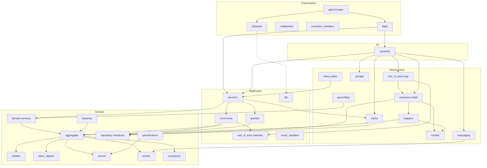
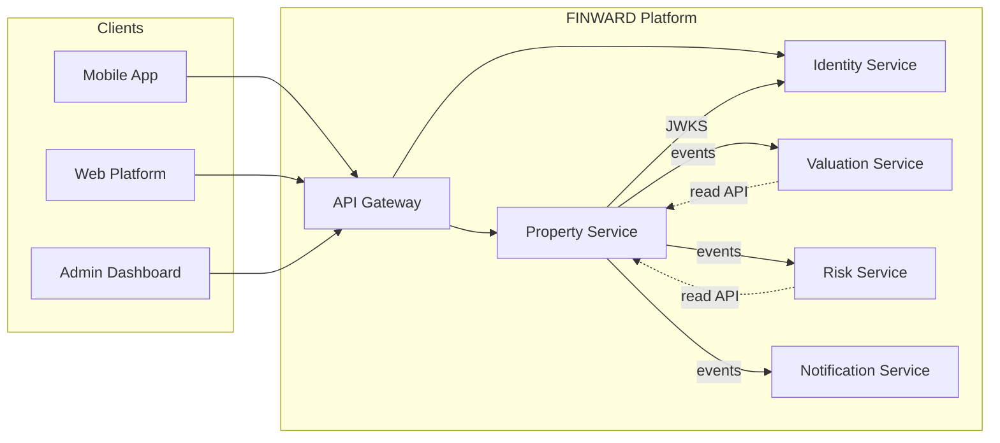
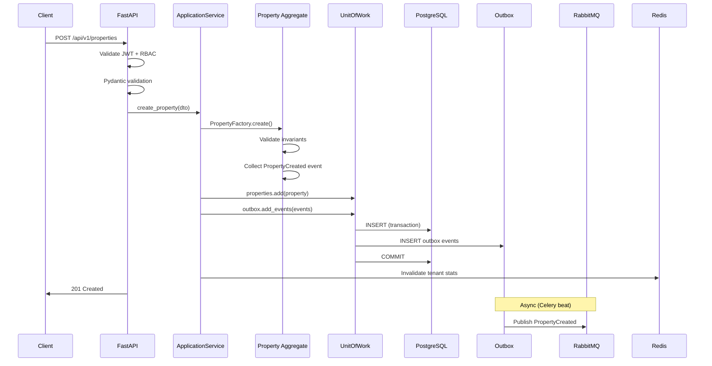

# 17. Dependency Graph

## Runtime Dependency Graph

```
┌─────────────────────────────────────────────────────────────────┐
│                     EXTERNAL CLIENTS                            │
│  Mobile │ Web │ Admin │ Enterprise API │ Partner API │ Workers   │
└────────────────────────────┬────────────────────────────────────┘
                             │
                             ▼
┌─────────────────────────────────────────────────────────────────┐
│                    PROPERTY SERVICE (FastAPI)                    │
│                                                                 │
│  presentation ──► application ──► domain ◄── infrastructure     │
│       │                │              │              │          │
│       │                │              │              │          │
│  middleware         commands/      aggregates     persistence   │
│  schemas            queries        entities       cache         │
│  exception_handlers  services      events         messaging     │
│                     unit_of_work   repositories   storage       │
│                                    (interfaces)   geocoding     │
│                                                   celery        │
└────┬────────┬────────┬────────┬────────┬────────┬────────────────┘
     │        │        │        │        │        │
     ▼        ▼        ▼        ▼        ▼        ▼
  Identity  PostgreSQL Redis  RabbitMQ  S3/MinIO Geocoding
  Service   +PostGIS                    (media)   Provider
  (JWT)
```

---

## Internal Module Dependency Graph



**Rule:** Arrows point in direction of dependency. Domain has zero outgoing arrows to outer layers.

---

## Python Package Dependencies (pyproject.toml)

### Core

| Package | Version | Purpose |
|---------|---------|---------|
| `fastapi` | ≥0.115 | API framework |
| `uvicorn[standard]` | ≥0.32 | ASGI server |
| `pydantic` | ≥2.10 | Validation, settings |
| `pydantic-settings` | ≥2.6 | Environment config |

### Database

| Package | Version | Purpose |
|---------|---------|---------|
| `sqlalchemy[asyncio]` | ≥2.0.36 | ORM |
| `asyncpg` | ≥0.30 | Async PostgreSQL driver |
| `alembic` | ≥1.14 | Migrations |
| `geoalchemy2` | ≥0.15 | PostGIS integration |

### Cache & Messaging

| Package | Version | Purpose |
|---------|---------|---------|
| `redis[hiredis]` | ≥5.2 | Redis client |
| `celery` | ≥5.4 | Task queue |
| `aio-pika` | ≥9.4 | Async RabbitMQ |

### Storage & HTTP

| Package | Version | Purpose |
|---------|---------|---------|
| `aioboto3` | ≥13.0 | S3 async client |
| `httpx` | ≥0.28 | HTTP client (geocoding, JWKS) |

### Security

| Package | Version | Purpose |
|---------|---------|---------|
| `python-jose[cryptography]` | ≥3.3 | JWT validation |
| `passlib` | ≥1.7 | API key hashing (if local) |

### Observability

| Package | Version | Purpose |
|---------|---------|---------|
| `structlog` | ≥24.4 | Structured logging |
| `opentelemetry-api` | ≥1.28 | Tracing |
| `opentelemetry-sdk` | ≥1.28 | Tracing |
| `opentelemetry-instrumentation-fastapi` | ≥0.49 | Auto-instrumentation |
| `prometheus-client` | ≥0.21 | Metrics |

### Dev / Test

| Package | Version | Purpose |
|---------|---------|---------|
| `pytest` | ≥8.3 | Testing |
| `pytest-asyncio` | ≥0.24 | Async tests |
| `pytest-cov` | ≥6.0 | Coverage |
| `testcontainers` | ≥4.8 | Integration tests |
| `ruff` | ≥0.8 | Linting |
| `mypy` | ≥1.13 | Type checking |
| `factory-boy` | ≥3.3 | Test fixtures |

---

## External Service Dependencies

| Service | Required | Fallback |
|---------|----------|----------|
| PostgreSQL + PostGIS | Yes | None — service cannot start |
| Redis | Yes | Degraded: no cache, no rate limit, no idempotency |
| RabbitMQ | Yes (for async) | API works; events queue in outbox only |
| S3/MinIO | Yes (for media) | Media upload endpoints return 503 |
| Identity Service (JWKS) | Yes | Cached keys (1h); stale keys on outage |
| Geocoding Provider | No | Properties created without coordinates; manual fix |

---

## Service-to-Service Communication



### Integration Contracts

| Consumer | Integration | Data Flow |
|----------|-------------|-----------|
| Mobile/Web | REST API via Gateway | Read/write properties |
| Valuation Service | Event: `PropertyPriceChanged` | Price updates |
| Risk Service | Event: `PropertyLocationChanged` | Location updates |
| Notification Service | Event: `PropertyStatusChanged` | Status alerts |
| Search Indexer (future) | Event: `Property*` | Index sync |
| finward-api (portfolio) | REST: link `real_estate` holdings to `property_id` | Reference only |

**Property Service never calls Valuation, Risk, or AI services.**

---

## Startup Dependency Order

```
1. Load configuration (settings)
2. Initialize structured logging
3. Connect PostgreSQL (pool)
4. Connect Redis
5. Run migrations (if RUN_MIGRATIONS=true)
6. Seed lookup tables (if SEED_LOOKUPS=true)
7. Connect RabbitMQ
8. Fetch JWKS (cache)
9. Wire DI container
10. Register routes, middleware, exception handlers
11. Start Uvicorn / Celery worker
```

Readiness probe fails until steps 3, 4, 7 complete.

---

## Data Flow: Create Property



---

## Circular Dependency Prevention

| Risk | Prevention |
|------|------------|
| Domain imports infrastructure | Repository interfaces in domain; impl in infra |
| Application imports presentation | DTOs in application layer; separate from Pydantic schemas |
| Celery tasks import API layer | Tasks call application services only |
| Mapper bidirectional coupling | Mappers in infrastructure only; one direction per method |
| Event handler mutates aggregate | Handlers trigger new commands, not direct mutation |
